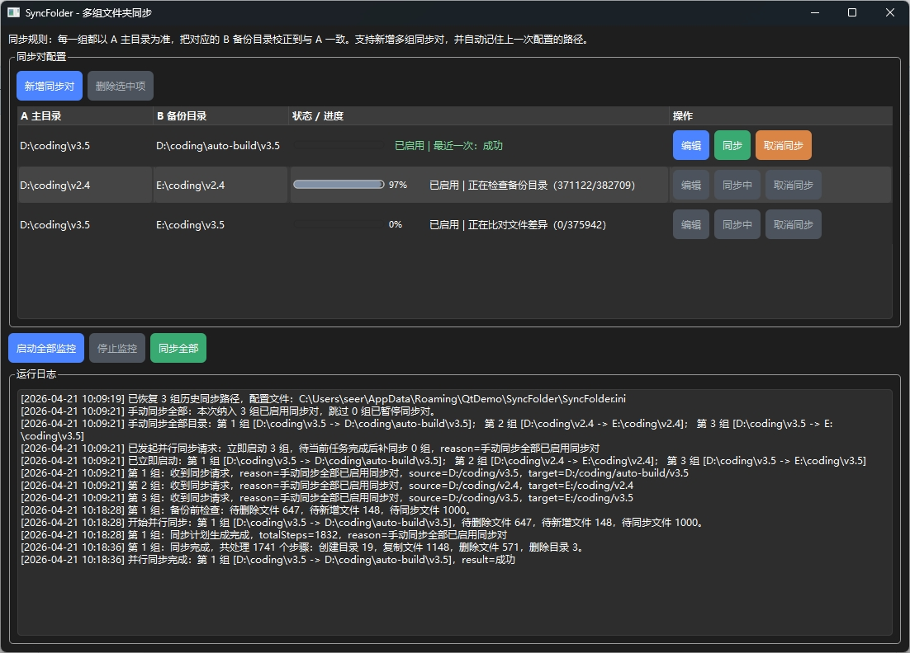

# SyncFolder

一个基于 `Qt Widgets + CMake` 的文件夹同步示例项目。

## 界面预览



- 支持动态维护多组 `A -> B` 同步对
- 每一组中 `A` 为主目录，`B` 为备份目录
- 启动监控后，程序会在后台线程中持续把每个 `B` 修正为与对应的 `A` 一致
- 提供进度条、运行日志、目录监控和周期校验
- 自动记录上一次配置的同步路径，重启后会恢复
- 配置会保存为当前用户 `AppData` 下的 `SyncFolder.ini`

## 功能说明

- 支持通过弹窗新增、编辑、删除多组同步对
- `QTableView` 每一行内置 `编辑`、`同步`、`取消同步/恢复同步` 按钮
- 初次启动监控时会对所有同步对执行一次全量同步
- 后续当任一组中的 `A` 或 `B` 发生变化时，会自动触发后台同步
- 即使监听漏掉事件，周期校验也会把各组 `B` 拉回到与对应 `A` 一致
- 同步规则是单向的：只以 `A` 为准，不会把 `B` 的内容反向写回 `A`
- 手动同步时既可以按行单独同步，也可以同步全部已启用项
- 同步开始前会先显示待删除、待新增、待同步文件数量，并在执行中刷新全局进度条

## 构建方式

```powershell
mkdir build
cd build
cmake -DCMAKE_PREFIX_PATH="C:\Qt\6.8.0\msvc2022_64" ..
cmake --build . --config Release
```

如果你使用的是 Qt 5，也可以把 `CMAKE_PREFIX_PATH` 指向对应的 Qt 5 安装目录。

## 使用方式

1. 点击 `新增同步对`，在弹窗中填写或选择一组 `A 主目录` 和 `B 备份目录`
2. 新增后，列表每一行都可以直接点击 `编辑`、`同步` 或 `取消同步/恢复同步`
3. 重复以上步骤，可以继续添加多组同步对
4. 点击 `启动全部监控`，程序会持续保持所有已启用同步对的 `B` 与 `A` 一致
5. 如果只想手动执行一次，可以点击某一行的 `同步` 或顶部的 `同步全部`
6. 运行日志会显示每次同步的触发原因、预检查统计和最终处理结果

## 当前约束

- 同一组中的 `A` 和 `B` 不能相同，也不能互相嵌套
- 为避免多组同步互相影响，任意 `B` 目录都不能与其他同步对的 `A/B` 目录重叠
- 当前版本不支持符号链接或目录联接
